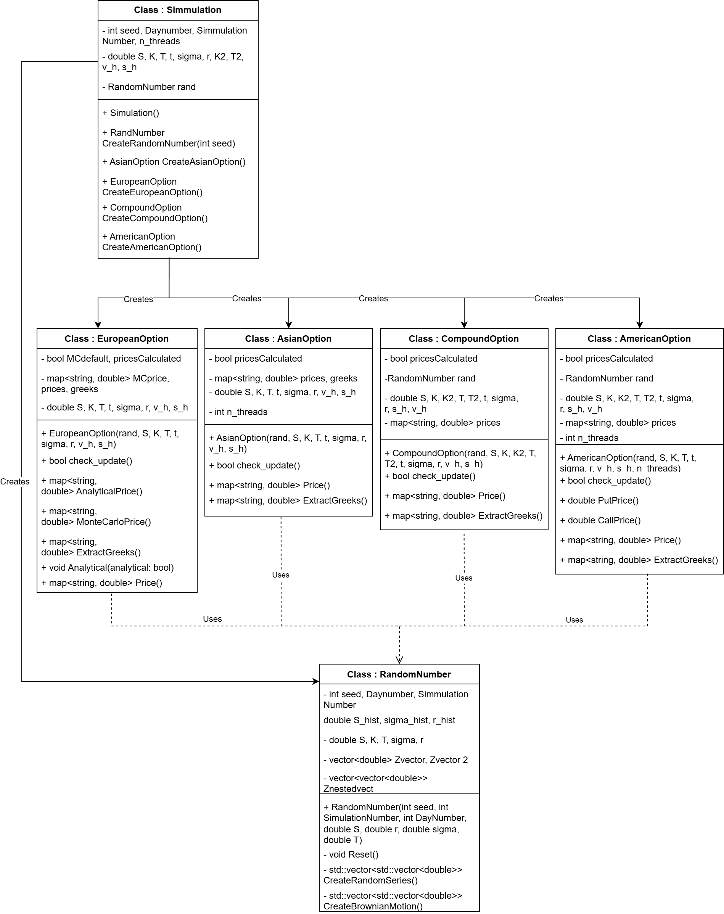

# Monte Carlo Option Pricing Library (C++)

This repository provides a Monte Carlo simulation library in C++ designed for pricing financial options. The library supports different option types, including European, Asian, American, and Compound options, leveraging stochastic processes and numerical methods for valuation.

## Features

- **Monte Carlo Simulation**: A robust framework for simulating stochastic processes.
- **Support for Multiple Option Types**:
  - European Options
  - Asian Options
  - American Options
  - Compound Options
- **Random Number Generation**:
  - Custom random number generator (`RandomNumber`) for generating Gaussian random variables and Brownian motion.
- **Greeks Calculation**: Extract option sensitivities such as delta, gamma, vega, and vomma.
- **Multithreading Support**: Utilize multiple threads for performance optimization.

## Class Structure



### Key Components

1. **Simulation Class**:
   - Manages the creation and orchestration of simulations for various options.
   - Creates and manages `RandomNumber` instances and option objects.
   - Methods to initialize and execute simulations.

2. **Option Classes**:
   - `EuropeanOption`, `AsianOption`, `AmericanOption`, `CompoundOption`
   - Each class implements pricing and Greeks extraction for the respective option type.
   - Uses `RandomNumber` for simulating stochastic processes.

3. **RandomNumber Class**:
   - Handles random number generation, Gaussian sampling, and Brownian motion.
   - Provides utilities for simulations, such as generating correlated random variables.

## Installation

### Prerequisites
- C++17 or later
- A C++ compiler (e.g., GCC, Clang, MSVC)
- CMake (optional, for build automation)

### Build Instructions
1. Clone the repository:
   ```bash
   git clone https://github.com/dietschleo/Monte-Carlo-Library-cpp
   cd Monte-Carlo-Library-cpp
   ```

2. Compile the project:
   ```bash
   g++ main.cpp Simulation.cpp RandomNumber.cpp AsianOption.cpp AmericanOption.cpp EuropeanOption.cpp CompoundOption.cpp -o monte_carlo -lpthread
   ```

3. Run the executable:
   ```bash
   ./monte_carlo
   ```

## Usage examples

### Pricing and Vega extraction for an Asian Option

```cpp
#include <iostream>
#include "Simulation.h"

int main() {
    // Initialize Simulation
    Simulation sim;
    sim.SimulationNumber = 100000;

    // Enable multi-threading
    sim.n_threads = 4;

    // Create Asian options
    auto option = sim.CreateAsianOption();

    // Iterate over S values
    for (int i = 90; i <= 110; ++i) {
        option.S = i;

        // Multi-threaded pricing
        auto greeks = option.ExtractGreeks();
        std::cout << option.S << " : fixed strike call price: " << option.prices["fixed_strike_call"]
                  << ", corresponding vega: " << option.greeks["fixed_strike_call_vega"] << std::endl;

        // Clear memory and reset for next iteration
        option.Clear();
        option.rand.Reset();
    }

    return 0;
}
   ```

   ```bash
   90 : fixed strike call price: 0.751269, corresponding vega: 11.6569
   91 : fixed strike call price: 0.904686, corresponding vega: 12.9664
   92 : fixed strike call price: 1.0815, corresponding vega: 14.2808
   93 : fixed strike call price: 1.28258, corresponding vega: 15.5388
   94 : fixed strike call price: 1.5093, corresponding vega: 16.7593
   ...
   ```
